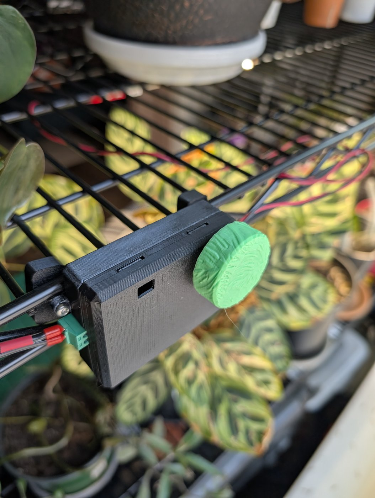
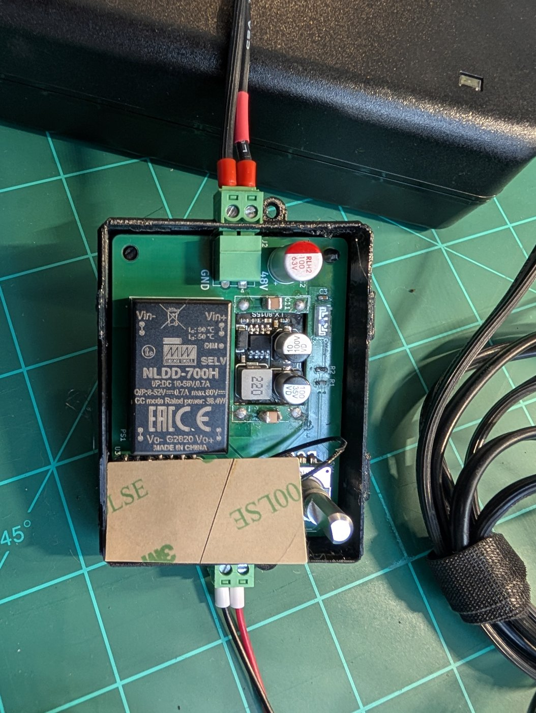
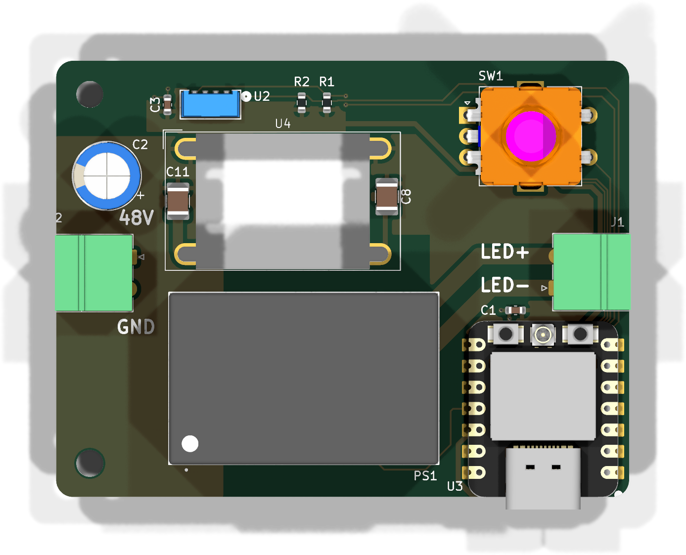
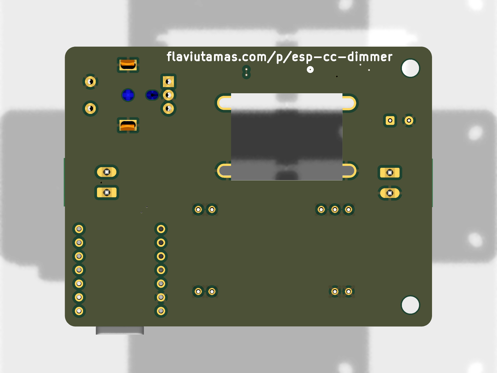
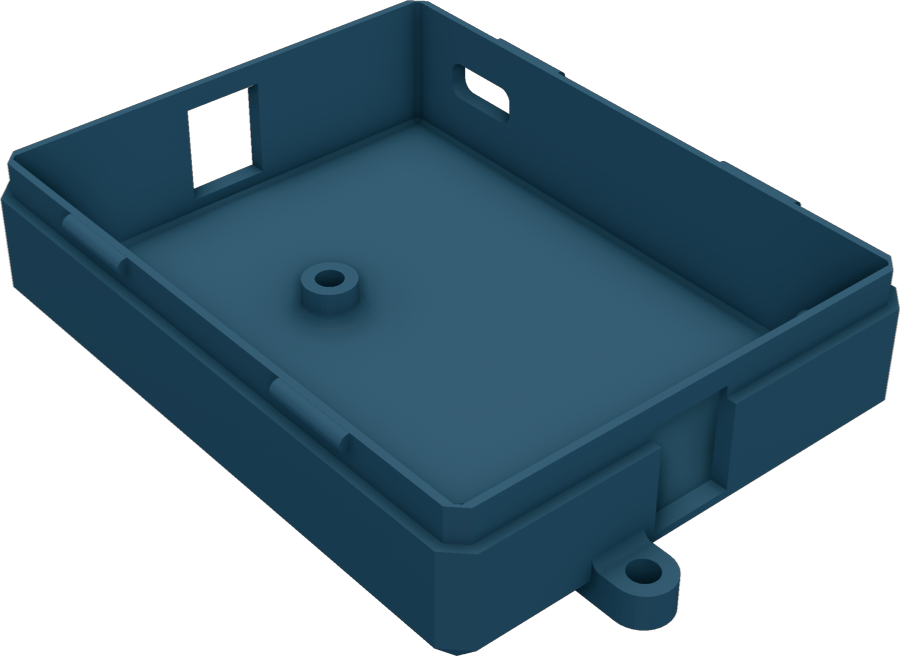
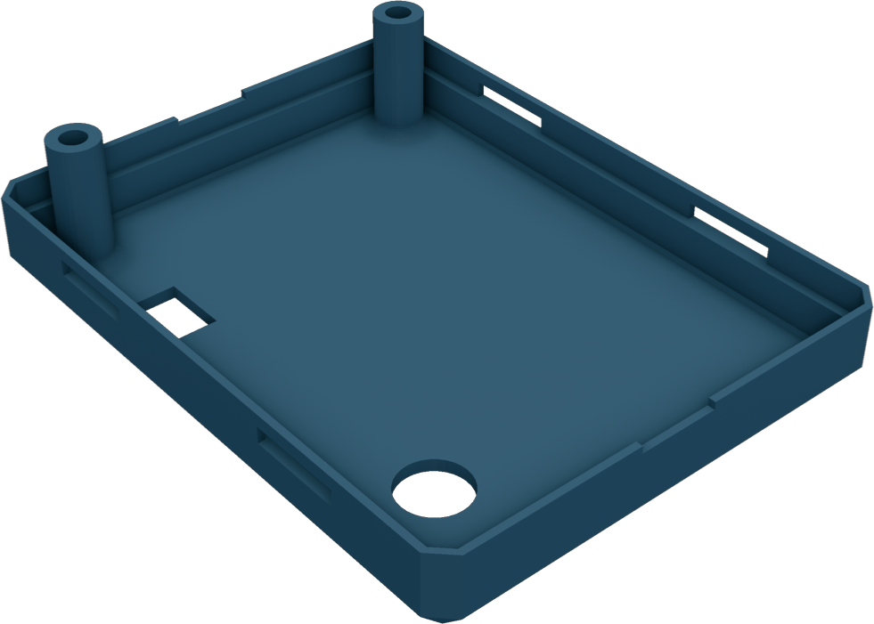
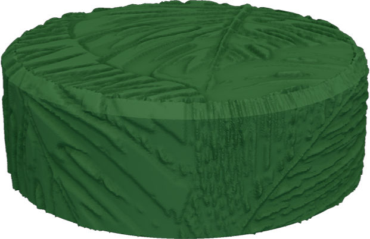
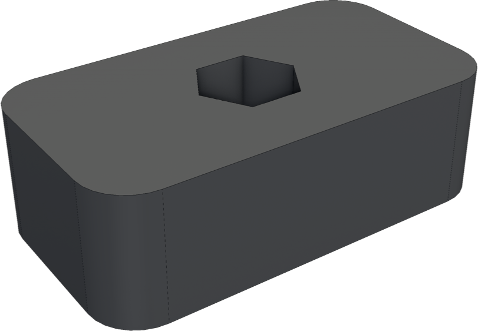

# ESP CC Dimmer

A Wi-Fi constant-current LED dimmer running ESPHome.

## Intended use

Designed to clamp onto wire shelving to dim a plant grow-light string. The
3D-printed enclosure bolts to two **shelf nuts** that slot behind the wire grid;
two M3×20 bolts and nylock nuts pinch the shelf wire between box and nuts. The
knob allows offline dimming.





## Power supply

Requirements:

- **10–56 V DC**, set by the NLDD-H input range (the board silk marks the 48 V
  design point).
- At least ~2 V above the LED string's forward voltage. Read your LED strip's datasheet.
- Current capacity ≥ your LED string + 50mA for the electronics.

## How it works

- **Power in (J2):** 10–56 V feeds both the NLDD driver and an LX8015 buck that
  derives 3V3 for the MCU.
- **Dimming:** the ESP32-C3 drives the NLDD's PWM dim input at 50 kHz (LEDC) —
  high-frequency PWM keeps the driver silent.
- **LED out (J1):** constant-current string from the NLDD-H.
- **Controls:** EC11 rotary encoder (turn = ±5 % brightness, press = toggle).
- **Sensing:** VEML7700 ambient-light sensor on I²C (GPIO6/7).

## Renders

| PCB top | PCB bottom |
|---------|------------|
|  |  |

| Enclosure base | Lid |
|----------------|-----|
|  |  |

| Knob | Shelf nut (×2) |
|------|----------------|
|  |  |

## Bill of Materials

Board: **68.25 × 52.0 mm**, 2-layer.

### Electronics

| Refs | Qty | Value / Part | Package | Notes |
|------|-----|--------------|---------|-------|
| U3 | 1 | Seeed XIAO ESP32-C3 | | |
| PS1 | 1 | Mean Well NLDD-1050H | | Any NLDD-350/500/700/1050H fits |
| U4 | 1 | LX8015 | | 3V3 for the MCU |
| U2 | 1 | Vishay VEML7700 | 6-pin OPLGA | I²C ambient-light sensor |
| SW1 | 1 | Alps EC11E15244G1 | EC11 vertical | Rotary encoder with push switch |
| J1, J2 | 2 | WJ15EDGRC-3.81-02P (clone) / Phoenix Contact MCV 1,5/2-G-3,81 — 1803426 (original) | | Board-side pluggable headers (power in / LED out) |
| (mates J1, J2) | 2 | WJ15EDGK-3.81-02P-14-00A (clone) / Phoenix Contact MC 1,5/2-ST-3,81 — 1803578 (original) | | Wire-side screw plug for each header |
| C2 | 1 | 100 µF 63 V | Radial Ø8 mm | |
| C11 | 1 | 4.7 µF 100 V | 1210 | |
| C8 | 1 | 10 µF | 1210 | |
| C1, C3 | 2 | 1 µF | 0603 | |
| R1, R2 | 2 | 4.7 kΩ | 0603 | |

### Mechanical

| Qty | Part | Notes |
|-----|------|-------|
| 1 | Enclosure base + lid | Print `enclosure/esp_cc_dimmer_box.stl` (both parts) |
| 1 | Dimmer knob | Print `enclosure/dimmer_knob_textured.stl` |
| 2 | Shelf nut | Print `enclosure/shelf_nut.step` |
| 2 | M3 × 20 mm bolt | Clamps box to shelf nuts |
| 2 | M3 nylock nut | — |

## Printing

- **Knob** (`dimmer_knob_textured.stl`): 0.12 mm layers, ironed top surface. The
  leaf texture was applied to the base model with [bumpmesh.com](https://bumpmesh.com)
  (`dimmer_knob.bumpmesh` + `leaves.png`).
- **Enclosure / shelf nuts:** standard 0.2 mm, no supports.

## Firmware

ESPHome config: [`esphome/esp-cc-dimmer.yaml`](esphome/esp-cc-dimmer.yaml).
Provide `wifi_ssid` / `wifi_password` via `secrets.yaml`, then:

```sh
esphome run esphome/esp-cc-dimmer.yaml
```
