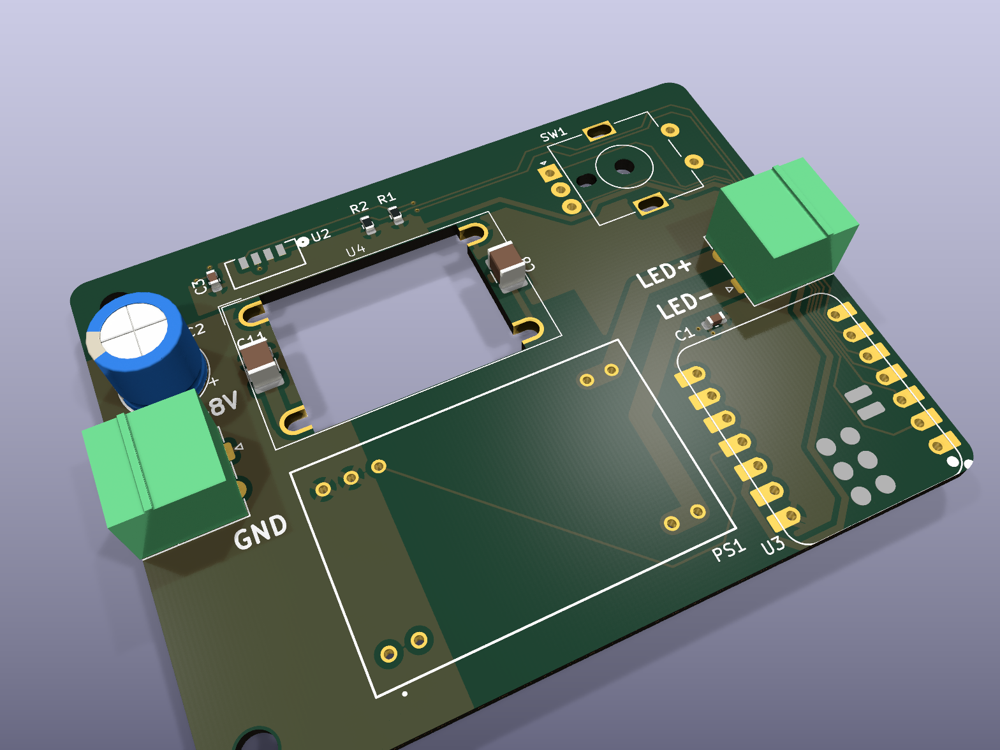
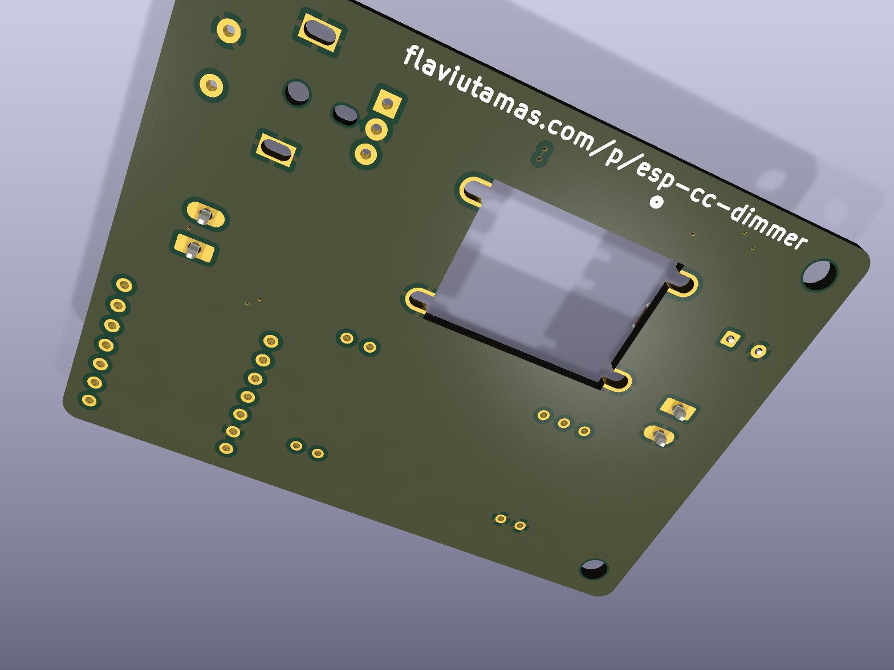
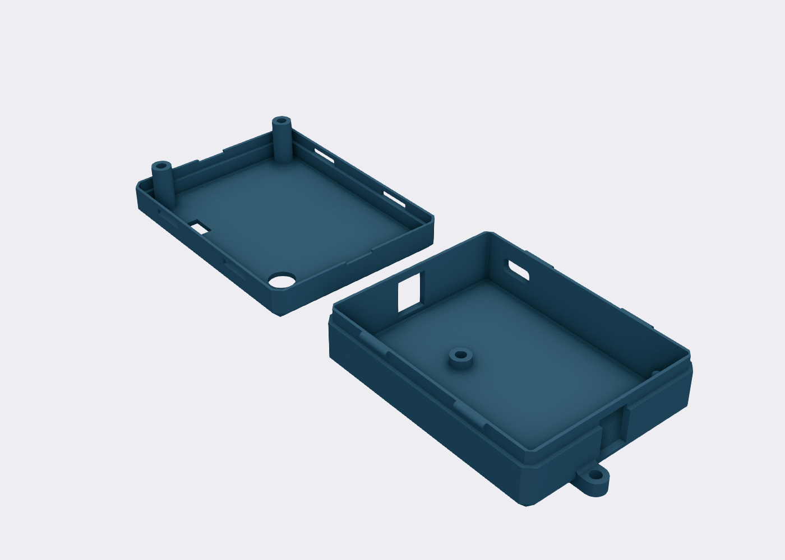

# ESP CC Dimmer

A Wi-Fi constant-current LED dimmer built around a Seeed XIAO ESP32-C3 and a
Mean Well NLDD-H driver, running [ESPHome](esphome/esp-cc-dimmer.yaml). A rotary
encoder sets brightness locally; a VEML7700 reports ambient light to Home
Assistant. The whole board takes a single 10–56 V supply and drives one
constant-current LED string.

| Top | Bottom |
|-----|--------|
|  |  |

3D-printed YAPP_Box enclosure (base + lid):



## How it works

- **Power in (J2):** 10–56 V feeds both the NLDD driver and an LX8015 buck that
  derives 3V3 for the MCU — no separate USB power needed in service.
- **Dimming:** the ESP32-C3 drives the NLDD's PWM dim input at 50 kHz (LEDC);
  see [NLDD-H silent dimming](esphome/esp-cc-dimmer.yaml) — high-frequency PWM
  keeps the driver quiet.
- **LED out (J1):** constant-current string from the NLDD-1050H.
- **Controls:** EC11 rotary encoder (turn = ±5 % brightness, press = toggle).
- **Sensing:** VEML7700 ambient-light sensor on I²C (GPIO6/7).

## Bill of Materials

See [docs/BOM.md](docs/BOM.md). Any NLDD-350/500/700/1050H works depending on
the desired drive current.

## Firmware

ESPHome config: [`esphome/esp-cc-dimmer.yaml`](esphome/esp-cc-dimmer.yaml).
Provide `wifi_ssid` / `wifi_password` via `secrets.yaml`, then:

```sh
esphome run esphome/esp-cc-dimmer.yaml
```

## Files

| Path | What |
|------|------|
| `esp_cc_dimmer.kicad_sch` / `.kicad_pcb` | KiCad 10 schematic and layout |
| `fab/esp_cc_dimmer_jlcpcb.zip` | Fabrication package |
| `enclosure/` | YAPP_Box enclosure + knob (OpenSCAD / 3MF / FreeCAD) |
| `esphome/` | ESPHome firmware |
| `docs/` | Renderings and BOM |
